# Analyse de la Freebox Révolution

- **Auteur** : Christophe Donnat - DonnatDev - christophe@donnat.dev
- **Client** : Mme Sadedine Malika - DMM Conseils - dmmconseils@hotmail.com
- **Matériel examiné** : Freebox Révolution du domicile de Mme Sadedine
- **Début de l'analyse** : 16 septembre 2026 à 07:38:38
- **Remarques** : L'analyse a été réalisée à distance via l'interface **Freebox OS**. Les informations présentées ci-dessous reflètent l'état de la Freebox et de la connexion Internet au moment du constat.

## Accès à distance

L'accès à distance à l'interface **Freebox OS** a été activé par Mme Sadedine à ma demande le **15 septembre 2026 à 12h27** pour me permettre d'explorer l'interface. Cette activation a été confirmée par un message affiché sur l'écran de la Freebox, indiquant que l'accès à distance était désormais disponible.

### État antérieur

Au moment du constat, l'option « Activer l'authentification par mot de passe » permettant l'accès distant à l'interface Freebox OS n'était pas activée. Les ports d'accès distant HTTP et HTTPS étaient néanmoins configurés. L'interface indique par ailleurs que l'accès distant demeure possible pour les applications autorisées et les liens de partage.

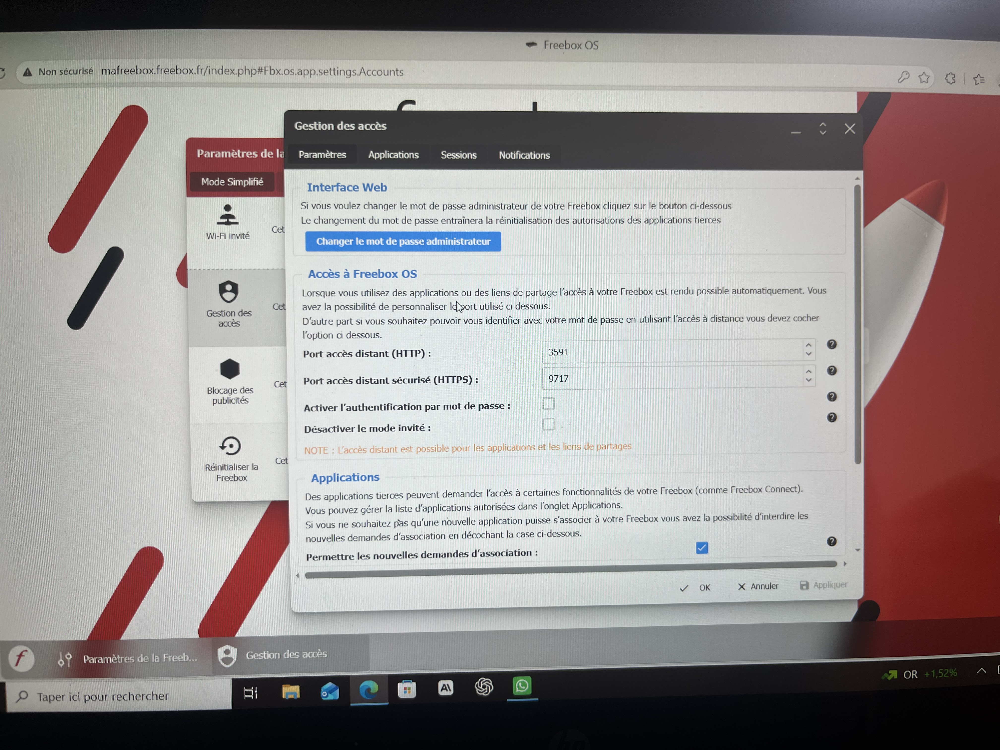{ width=50% }

### Activation de l'accès à distance

Mme Sadedine m'a remis l'**adresse de connexion à distance**, ainsi que le **mot de passe** associé, afin que je puisse accéder à l'interface **Freebox OS** pour effectuer l'analyse.

**Il faudra désactiver l'accès à distance et modifier le mot de passe après la fin de l'analyse**, afin de sécuriser l'accès à la Freebox et de protéger les informations personnelles de Mme Sadedine.

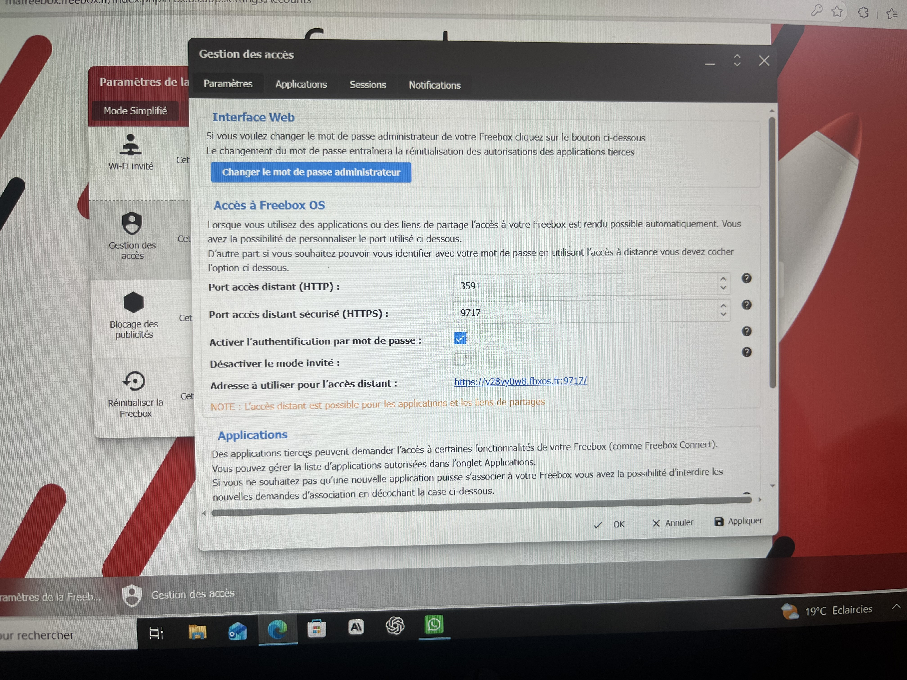{ width=50% }

## État de la Freebox et de la connexion Internet

Lors du contrôle de l'interface **Freebox OS**, la Freebox apparaît connectée à Internet au moyen d'une liaison **FTTH (Fiber To The Home)**.

### État de la connexion Internet

L'écran d'état de la connexion Internet indique les informations suivantes au moment du constat :

- connexion Internet : **active** ;
- type de connexion : **FTTH** ;
- adresse IPv4 publique affichée : **88.178.32.36** ;
- plage de ports IPv4 attribuée : **0 à 16383** ;
- adresse IPv6 affichée : **2a01:e0a:c88:900::1** ;
- volume de données reçu : **4,2 Go** ;
- volume de données émis : **927,2 Mo** ;
- débit maximal indiqué : **1 Gb/s descendant** et **900 Mb/s montant**.

La mention d'une plage de ports IPv4 limitée à **0-16383** indique que l'adresse IPv4 affichée est utilisée avec une attribution partielle de ports.

> En conséquence, dans le cadre de l'analyse de journaux de connexion, une adresse IPv4 seule peut ne pas être suffisante pour attribuer une connexion à cette Freebox : l'**horodatage** et, lorsqu'il est disponible, le **numéro de port source** constituent également des éléments importants.

### État de la liaison fibre

Concernant la liaison fibre, Freebox OS indique :

- état du lien : **Up** ;
- module fibre présent : **Oui** ;
- signal optique : **Présent** ;
- alimentation : **OK** ;
- fabricant du module SFP : **TLE TUNG-LI** ;
- modèle : **OF001-003C** ;
- numéro de série : **2107071255**.

Ces informations décrivent **l'état de la Freebox au moment du constat**. Elles ne permettent pas, à elles seules, de déterminer l'état de la connexion, l'adresse IP attribuée ou la plage de ports utilisée à une date antérieure, notamment en octobre 2024. Toute conclusion concernant cette période devra donc être fondée sur des journaux historiques ou d'autres éléments techniques permettant une corrélation temporelle.

### Historique de connexion

L'historique de connexion consulté fait apparaître, pour le **16 septembre 2026**, deux événements successifs :

- à **09:48:05**, établissement du **lien FTTH**, avec un état « Connecté » et un débit de liaison indiqué de **1 Gb/s en réception** et **900 Mb/s en émission** ;
- à **09:48:26**, établissement de la **connexion Internet FTTH publique**, également indiquée comme « Connectée ».

## Gestion des accès

### Applications

3 applications sont actuellement autorisées à accéder à la Freebox via l'interface **Freebox OS** :

1. Freebox Connect (iPhone de dmm conseils) : dernier accès le 21/02/2022 à 00:23:12 ;
2. Freebox Connect (iPhone) : dernier accès le 21/09/2026 à 12:17:20 ;
3. Free (iPhone) : dernier accès le 08/04/2026 à 01:31:09.

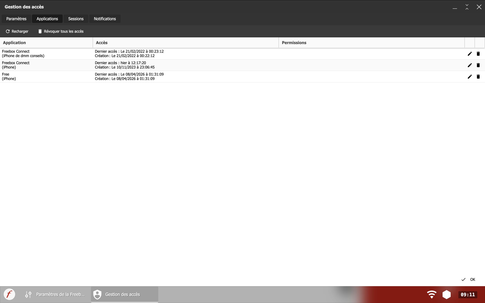{ width=50% }

#### Droits d'accès des applications

**Au moment du constat, les droits d'accès des applications autorisées étaient nuls**, ce qui signifie qu'aucune application n'avait la possibilité de modifier la configuration de la Freebox ou d'accéder à des informations sensibles.

**Cela ne préjuge pas de l'état des droits d'accès à une date antérieure, notamment en octobre 2024.** Il est donc nécessaire de vérifier les journaux historiques pour déterminer si des applications avaient des droits d'accès à cette période.

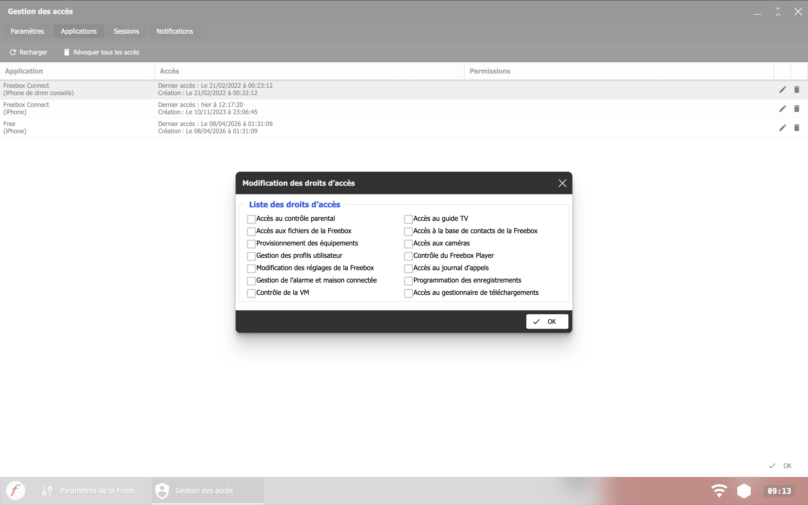{ width=50% }

### Sessions

Lors du constat, l'onglet « Sessions » de la gestion des accès faisait apparaître **une seule session active** à l'interface Freebox OS. Cette session, ouverte le 22 septembre 2026 à 07:38:38, était associée à l'adresse IPv6 2001:861:51c4:5820:4034:8cbe:15e9:b1be.

Cette session correspond à l'accès à distance que j'avais ouvert pour effectuer l'analyse. Elle était toujours active au moment du constat, ce qui indique que l'accès à distance n'avait pas été désactivé depuis mon intervention. Cette ligne de session est donc parfaitement cohérente et normale.

Cet écran décrit les sessions actives au moment du constat et ne constitue pas, à lui seul, un historique des connexions antérieures.

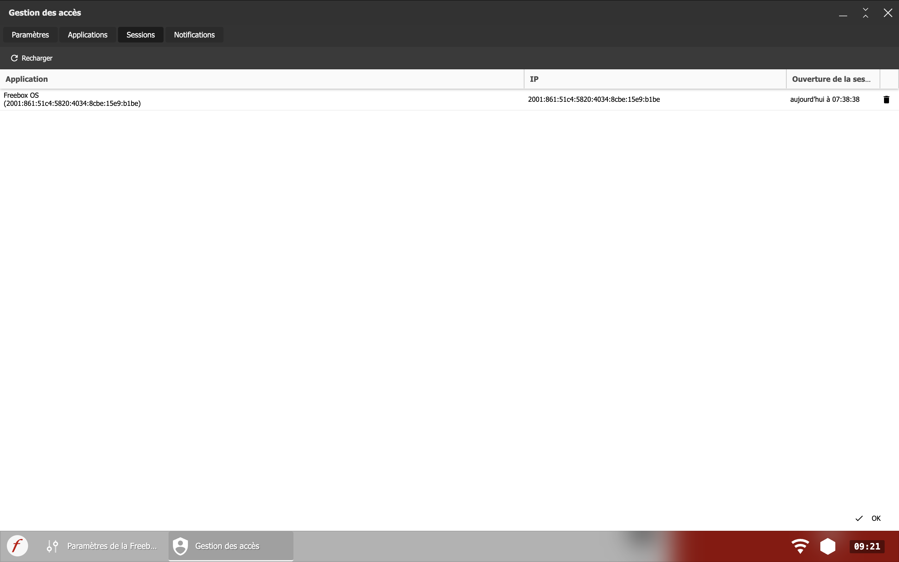{ width=50% }

### Notifications

L'onglet « Notifications » fait apparaître un iPhone enregistré auprès du service de notification de Freebox Connect. Cet appareil est abonné aux catégories « Périphériques réseaux » et « Mot de passe ». La dernière utilisation enregistrée est datée du 21 septembre 2026 à 12:17:18. Cet horaire est cohérent avec le dernier accès relevé à 12:17:20 pour une application Freebox Connect associée à un iPhone.

- Appareil : iPhone
- Identifiant technique de notification : `6FE961F4-05AF-478D-9640-E57C7B9F3D80-notification`
- URL du serveur : <https://api.scw.iliad.fr/notifications/freebox/connect>
- Type de notification : firebase
- Type de message : notification
- Abonnements :
  - Périphériques réseaux
  - Mot de passe
- Dernière utilisation : hier à 12:17:18

> Le 21 septembre 2026 vers 12:17, l'application Freebox Connect associée à un iPhone a enregistré un accès à 12:17:20. Le service de notifications associé au même type d'appareil a enregistré une dernière utilisation à 12:17:18. Ces horaires sont cohérents avec les opérations de configuration réalisées par Mme Sadedine à cette période, notamment l'accès aux paramètres de la Freebox. Cette corrélation temporelle ne permet toutefois pas, à elle seule, d'attribuer précisément ces événements à une action déterminée.

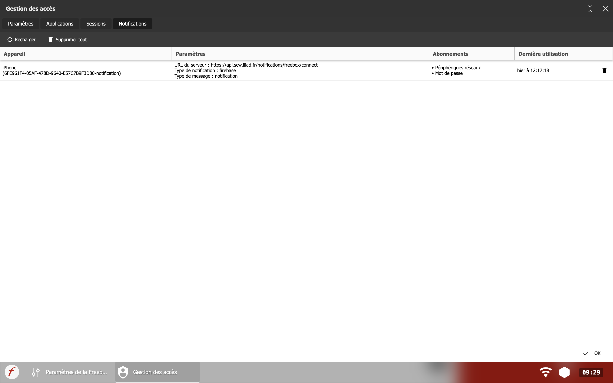{ width=50% }

## Connexion internet

### Configuration

La configuration au moment de l'analyse correspond bien à celle affichée dans la capture d'écran envoyée par Mme Sadedine après l'activation de l'accès à distance. On retrouve notamment :

- Port accès distant (HTTP) : 3591
- Port accès distant (HTTPS) : 9717

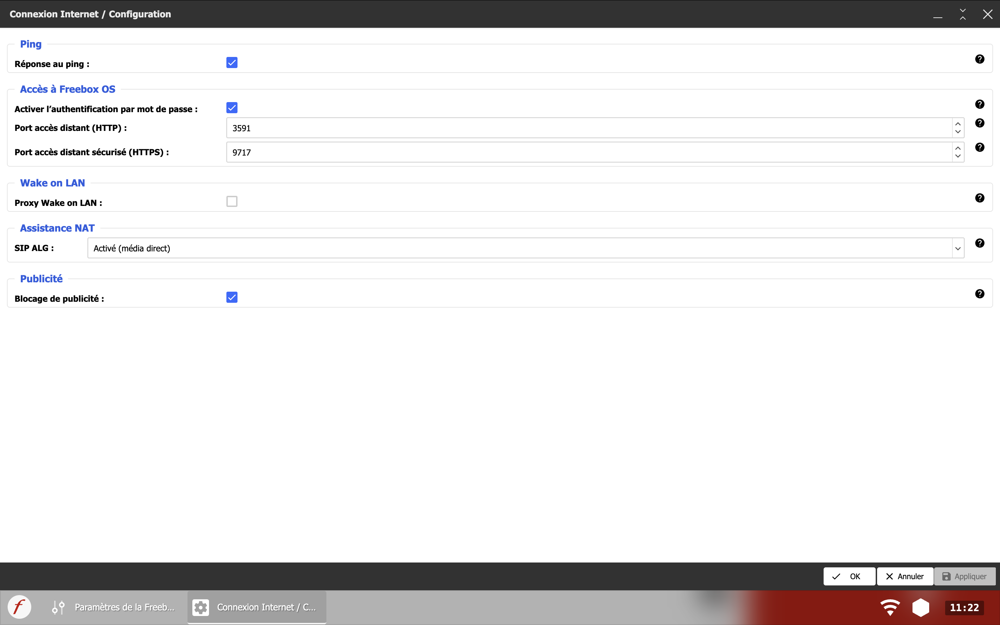{ width=50% }

### Configuration IPv6

La configuration IPv6 de la Freebox fait apparaître un préfixe principal `2a01:e0a:c88:900::/64` ainsi que plusieurs préfixes secondaires successifs. Aucun « Next Hop » n'était configuré pour ces sous-réseaux au moment du constat. Le pare-feu IPv6 intégré à la Freebox apparaissait désactivé.

Le pare-feu IPv6 intégré à la Freebox était désactivé au moment du constat. En conséquence, la Freebox n'appliquait pas de filtrage IPv6 entrant via cette fonction. La seule désactivation de ce pare-feu ne permet toutefois pas d'établir qu'un équipement du réseau était effectivement accessible depuis Internet, cette accessibilité dépendant également de la configuration IPv6, des services exposés et des mécanismes de filtrage propres à chaque appareil.

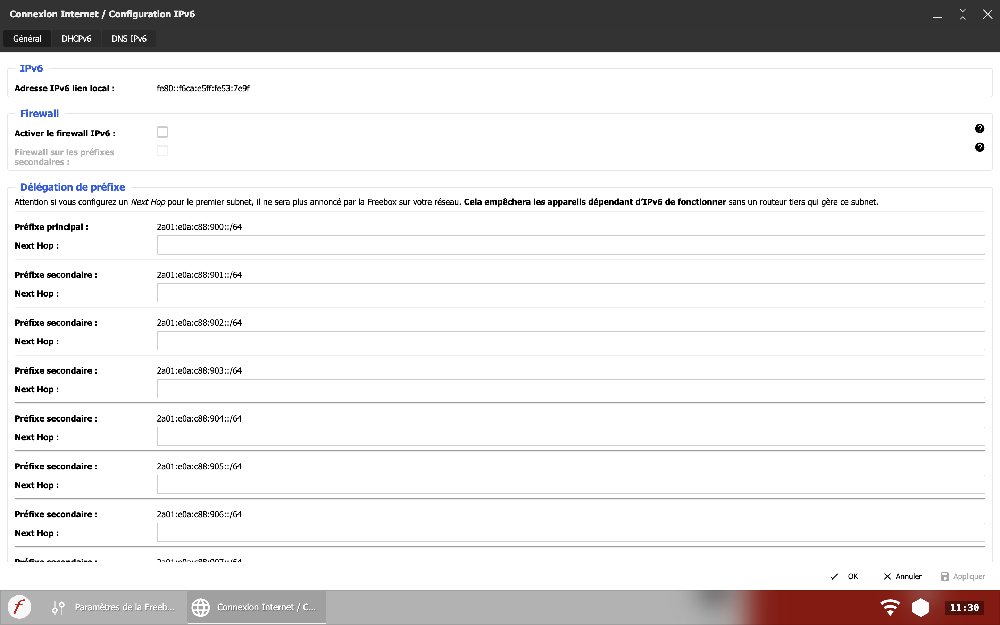{ width=50% }

### DNS dynamique

Le service de DNS dynamique intégré à la Freebox n'était pas configuré au moment du constat. Les trois fournisseurs proposés par l'interface - DynDNS, No-IP et OVH - apparaissaient désactivés.

### Serveur VPN et client VPN

La Freebox dispose de fonctions de serveur VPN prenant en charge plusieurs protocoles, notamment PPTP, OpenVPN, IPsec IKEv2 et WireGuard. Lors du constat, l'ensemble de ces services apparaissait désactivé. Aucun accès au réseau local via le serveur VPN intégré de la Freebox n'était donc actif au moment de l'examen.

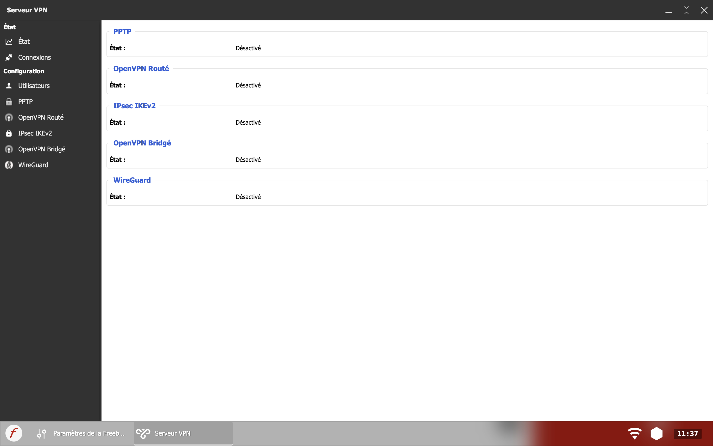{ width=50% }

Lors du constat, le client VPN intégré à la Freebox était indiqué comme inactif. Le journal de connexion associé ne contenait aucune entrée visible. Aucun tunnel VPN sortant actif ni aucune trace de connexion antérieure n'a donc été relevé dans cette section de Freebox OS au moment de l'examen.

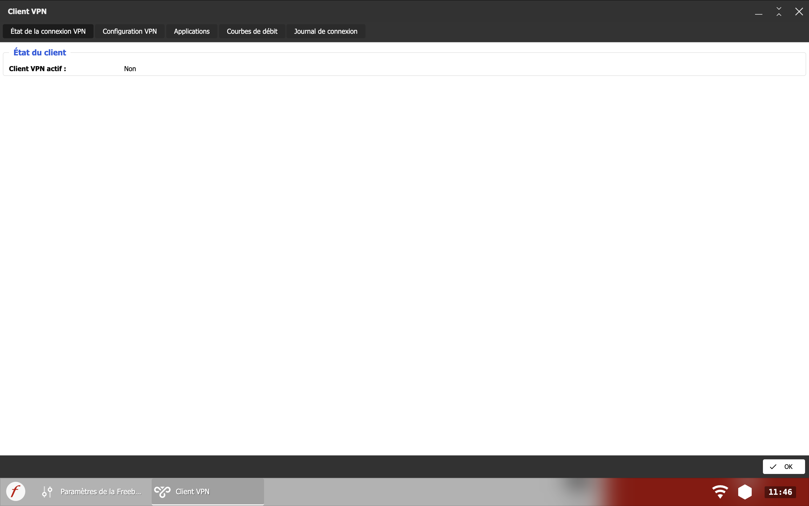{ width=50% }

### Redirection de ports et gestion de ports

La configuration de gestion des ports ne faisait apparaître aucune redirection de port active ou configurée. La fonction DMZ était également désactivée. Aucun équipement du réseau local n'était donc exposé via ces mécanismes IPv4 au moment du constat.

L'examen de la gestion des ports fait apparaître plusieurs services entrants gérés automatiquement par Freebox OS. Au moment du constat, les accès distants à Freebox OS étaient indiqués comme actifs sur les ports 3591 et 9717. Les ports associés au client BitTorrent intégré de la Freebox étaient également actifs (9830 pour le mécanisme DHT et 13035 pour le port principal).

Les services FTP ainsi que l'ensemble des protocoles de serveur VPN proposés par la Freebox (PPTP, OpenVPN, IPsec/IKEv2 et WireGuard) apparaissaient inactifs.

Par ailleurs, aucune redirection de port manuelle et aucune DMZ n'étaient configurées. Ces constatations décrivent l'état de la configuration au moment de l'examen et ne permettent pas de déterminer si des services différents avaient été activés antérieurement.

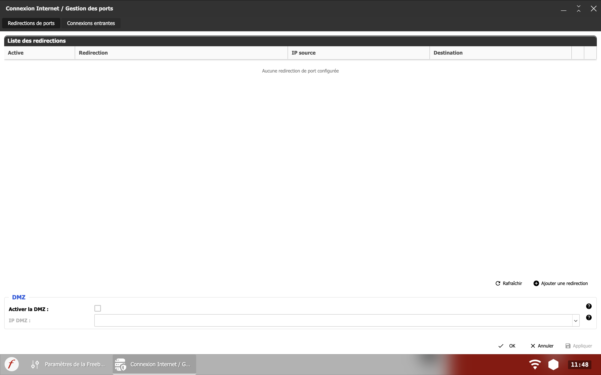{ width=50% }

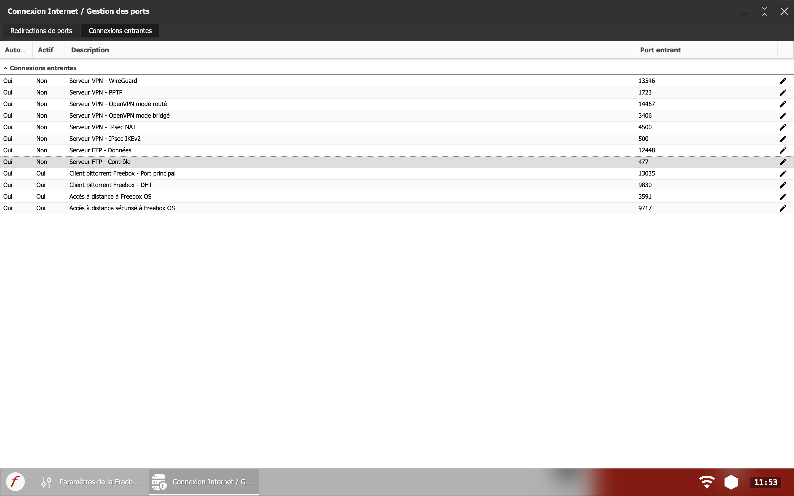{ width=50% }

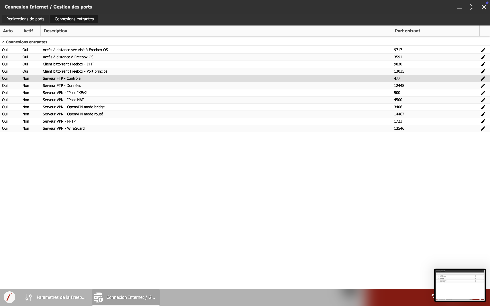{ width=50% }

## Réseau local

### Liste des équipements connectés fournie par Mme Sadedine

Mme Sadedine m'a fourni la liste des équipements connectés chez elle.

Voici la liste propre des équipements que Mme Sadedine m'a signalés comme étant les siens ou présents régulièrement chez elle :

- Caméra terrasse - caméra Action
- Caméra salon - caméra Action
- Caméra chambre - caméra Action, utilisée surtout lors des absences/voyages
- Caméra entrée - système Xiaomi Home
- iPhone 13 vert - encore utilisé, avec numéro anglais
- iPhone 13 mini - téléphone courant, acheté en 2025
- iPhone 11 Pro - utilisé ponctuellement, environ une fois par mois, avec numéro étranger
- Ordinateur portable HP
- Ordinateur Asus - anciennement saisi, rallumé récemment
- Imprimante Samsung connectée
- Imprimante HP - non utilisée depuis plusieurs semaines

Appareils de tiers pouvant apparaître ponctuellement sur le réseau :

- Samsung de Cherifa
- iPhone « doudou » / Daklia

Noms d'iPhone mentionnés par Mme Sadedine :

- iPhone de Malika
- iPhone de dmm conseils

### Mode réseau

La Freebox était configurée en mode routeur. Son adresse IPv4 sur le réseau local était `192.168.1.254` et le domaine local configuré était `home`. Le serveur Freebox était annoncé sous différents noms selon les mécanismes de résolution utilisés : `freebox-server` pour DNS, `Freebox-Server` pour mDNS et `Freebox_Server` pour NetBIOS.

### Wi-Fi

La Freebox disposait de deux interfaces Wi-Fi actives, en 2,4 GHz et 5 GHz. L'interface 2,4 GHz observée utilisait le canal 6 avec une largeur de bande de 20 MHz et une authentification WPA2. Plusieurs stations étaient associées ou récemment actives, notamment deux iPhone ainsi que plusieurs équipements identifiés par Freebox OS comme provenant de fabricants de modules ou objets connectés, dont Tuya Smart Inc. et Shenzhen Bilian Electronic Co., Ltd. Les adresses MAC, niveaux de signal, durées de connexion et volumes de données associés ont été relevés.

6 appareils / stations Wi-Fi ont été identifiés au moment du constat :

- wlan0 - MAC `1C:90:FF:9D:B8:4A`
- iPhone - MAC `6A:92:E3:54:E4:62`
- 192-168-1-195 - MAC `70:70:AA:0D:EC:11`
- Shenzhen Bilian Electronic Co., Ltd - MAC `C4:3C:B0:23:34:46`
- Tuya Smart Inc. - MAC `CC:8C:BF:8E:33:8A`
- iPhone - MAC `D2:0E:25:1B:5B:B8`

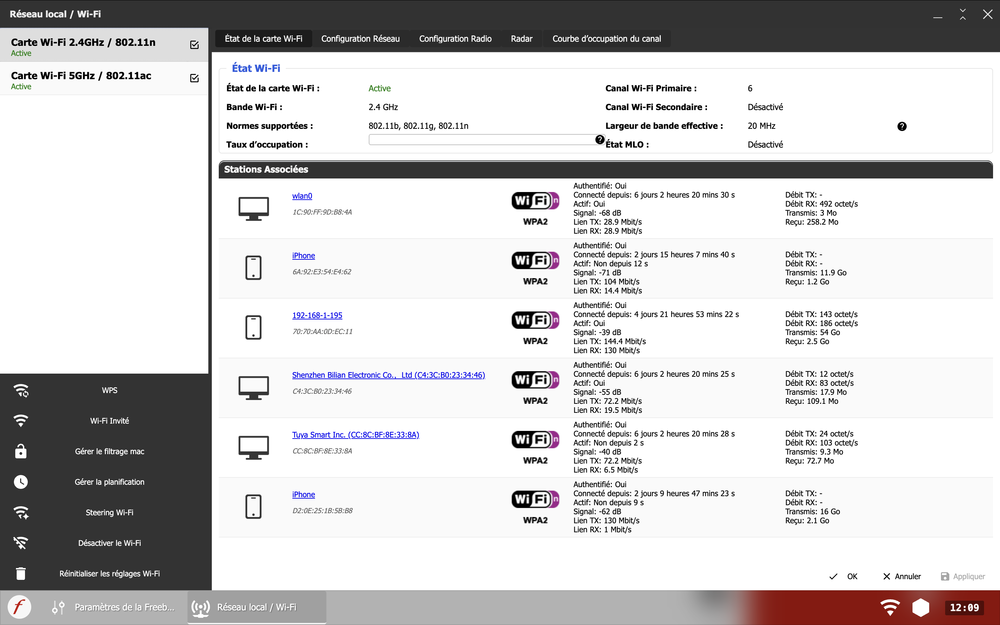{ width=50% }

### WPS

L'historique des sessions WPS de la Freebox était vide au moment du constat. Aucune association d'appareil via WPS n'était donc visible dans l'historique disponible. Cette absence d'entrée ne permet toutefois pas d'exclure un usage antérieur du WPS qui ne serait plus conservé par la Freebox.

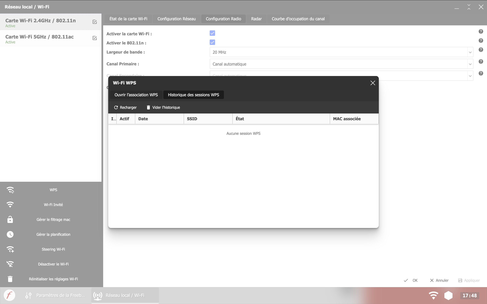{ width=50% }

### DHCP

L'examen des baux DHCP actifs a permis d'établir une correspondance entre plusieurs adresses MAC et adresses IPv4 locales. Deux iPhone disposaient respectivement des adresses `192.168.1.18` et `192.168.1.73`. Une caméra identifiée par la Freebox sous le nom `mxiang-camera-mwc10_miap06DE` disposait de l'adresse `192.168.1.135`. Trois autres équipements, identifiés sous les noms `wlan0`, `STARVOX-98AAFC131893` et `192-168-1-195`, disposaient respectivement des adresses `192.168.1.159`, `192.168.1.169` et `192.168.1.195`.

Cela permet d'établir des correspondances pour identifier les équipements connectés au réseau local de la Freebox. Les informations relevées sont les suivantes :

- wlan0 - MAC `1C:90:FF:9D:B8:4A` - IP `192.168.1.159` - appareil encore non identifié précisément ; peut être l'imprimante
- iPhone - MAC `6A:92:E3:54:E4:62` - IP `192.168.1.73` - téléphone
- 192-168-1-195 - MAC `70:70:AA:0D:EC:11` - IP `192.168.1.195`
- Shenzhen Bilian Electronic Co., Ltd - MAC `C4:3C:B0:23:34:46` - fabricant de module Wi-Fi, Bluetooth ou carte réseau ; probablement une caméra ou l'imprimante ; appareil encore non identifié précisément
- Tuya Smart Inc. - MAC `CC:8C:BF:8E:33:8A` - plateforme/écosystème IoT utilisé par de nombreux fabricants d'objets connectés ; probablement une caméra ; appareil encore non identifié précisément
- iPhone - MAC `D2:0E:25:1B:5B:B8` - IP `192.168.1.18` - téléphone

J'ai aussi identifié un autre équipement qui n'était pas dans la liste initiale :

- `mxiang-camera-mwc10_miap06DE` - MAC `E0:A2:5A:0D:06:DF` - IP `192.168.1.135` - probablement la caméra Xiaomi Home de l'entrée (le morceau `camera` indique clairement un équipement caméra, et le préfixe `mxiang` / `mi...` est compatible avec l'écosystème Xiaomi/Mijia)

> Les équipements connectés semblent correspondre à ceux signalés par Mme Sadedine, mais il faudrait avoir la liste des adresses MAC de tous les appareils pour confirmer l'identité de chacun. Les correspondances établies sont basées sur les informations disponibles au moment du constat.

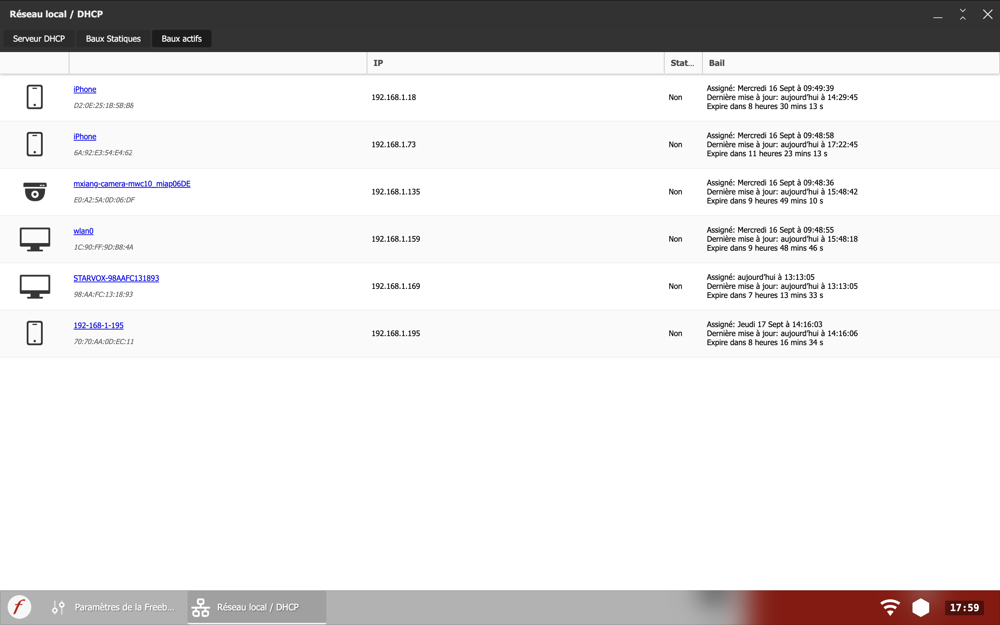{ width=50% }

### Switch

L'examen du switch intégré à la Freebox fait apparaître trois ports disposant d'une liaison physique active. Le port Ethernet 1 dessert l'équipement `mxiang-camera-mwc10_miap06DE`, identifié par l'adresse MAC `E0:A2:5A:0D:06:DF` et précédemment associé à l'adresse IPv4 `192.168.1.135`. Le port Ethernet 2 dessert l'équipement `STARVOX-98AAFC131893`, adresse MAC `98:AA:FC:13:18:93`, associé à l'adresse IPv4 `192.168.1.169`. Le port Ethernet 3 était inactif. Le port Ethernet 4 présentait une liaison active, sans adresse MAC affichée dans cette vue au moment du constat.

- `mxiang-camera-mwc10_miap06DE` - MAC `E0:A2:5A:0D:06:DF` - IP `192.168.1.135` - Ethernet 1
- `STARVOX-98AAFC131893` - MAC `98:AA:FC:13:18:93` - IP `192.168.1.169` - Ethernet 2 - équipement très probablement lié à un système d'alarme/télésurveillance Surtec Starvox
- équipement non identifié - MAC non affichée - IP non déterminée - Ethernet 4
- Ethernet 3 inactif

> Le préfixe MAC `98:AA:FC:1...` correspond à une plage attribuée à Surtec. Starvox est le nom d'un système d'alarme/télésurveillance commercialisé par Surtec : une centrale sans fil destinée à la protection anti-intrusion, avec transmission téléphonique/GSM et fonctions de télésurveillance.

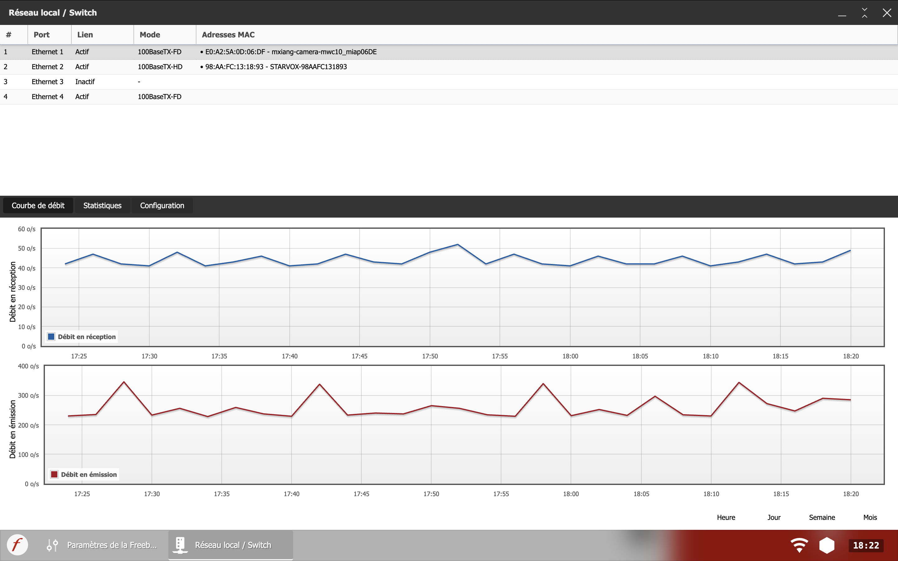{ width=50% }

### UPnP IGD

Le service UPnP IGD était activé sur la Freebox, permettant théoriquement aux équipements du réseau local de demander automatiquement l'ouverture de ports entrants. Toutefois, aucune redirection UPnP active n'était présente au moment du constat.

Cela ne permet pas de dire qu'aucune redirection UPnP n'a jamais existé auparavant, seulement qu'il n'y en avait aucune d'active à cet instant.

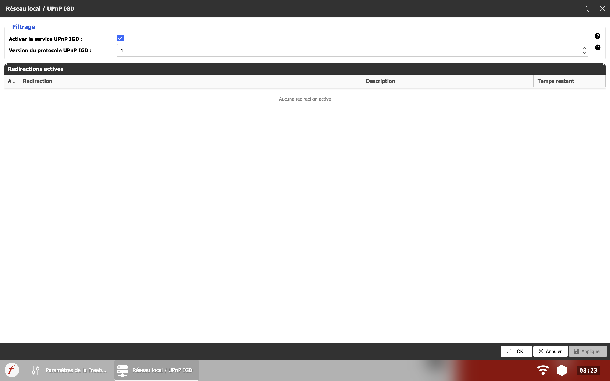{ width=50% }

### Cartographie des équipements actuels trouvés à ce stade

- **mxiang-camera-mwc10_miap06DE**
  - Adresse MAC : `E0:A2:5A:0D:06:DF`
  - IPv4 : `192.168.1.135`
  - Connexion : Ethernet 1
  - Identité probable : caméra IP, probablement la caméra Xiaomi Home de l'entrée - à confirmer.
- **STARVOX-98AAFC131893**
  - Adresse MAC : `98:AA:FC:13:18:93`
  - IPv4 : `192.168.1.169`
  - Connexion : Ethernet 2
  - Identité probable : très probablement centrale / équipement d'alarme Starvox.
- **wlan0**
  - Adresse MAC : `1C:90:FF:9D:B8:4A`
  - IPv4 : `192.168.1.159`
  - Connexion : Wi-Fi 2,4 GHz
  - Identité probable : appareil embarqué non identifié ; imprimante ou objet connecté possible.
- **iPhone**
  - Adresse MAC : `6A:92:E3:54:E4:62`
  - IPv4 : `192.168.1.73`
  - Connexion : Wi-Fi 2,4 GHz
  - Identité probable : un des iPhone de Mme Sadedine - modèle à déterminer.
- **iPhone**
  - Adresse MAC : `D2:0E:25:1B:5B:B8`
  - IPv4 : `192.168.1.18`
  - Connexion : Wi-Fi 2,4 GHz
  - Identité probable : un des iPhone de Mme Sadedine - modèle à déterminer.
- **192-168-1-195**
  - Adresse MAC : `70:70:AA:0D:EC:11`
  - IPv4 : `192.168.1.195`
  - Connexion : Wi-Fi 2,4 GHz
  - Identité probable : appareil non identifié ; activité réseau importante, possiblement caméra ou autre équipement.
- **Shenzhen Bilian Electronic Co., Ltd**
  - Adresse MAC : `C4:3C:B0:23:34:46`
  - IPv4 : non déterminée à ce stade
  - Connexion : Wi-Fi 2,4 GHz
  - Identité probable : objet connecté utilisant un module Wi-Fi Bilian ; caméra possible.
- **Tuya Smart Inc.**
  - Adresse MAC : `CC:8C:BF:8E:33:8A`
  - IPv4 : non déterminée à ce stade
  - Connexion : Wi-Fi 2,4 GHz
  - Identité probable : objet connecté Tuya ; caméra possible.
- **Équipement non identifié**
  - Adresse MAC : non affichée
  - IPv4 : non déterminée
  - Connexion : Ethernet 4
  - Identité probable : équipement physiquement connecté, mais non identifié dans cette vue.

### Précisions sur STARVOX-98AAFC131893

Après vérification auprès de Mme Sadedine, l'équipement identifié par la Freebox sous le nom `STARVOX-98AAFC131893` correspond bien à la centrale d'alarme Starvox aujourd'hui inutilisée, mais qui était installée dans le logement.

## Disque dur

La Freebox comporte un disque dur interne HGST modèle HCC545050A7E630 d'une capacité nominale de 500,1 Go, utilisant une table de partitions de type MBR. Au moment du constat, le disque était indiqué comme actif, avec une température de 49 °C. Freebox OS faisait état de 2 801 220 opérations de lecture et 160 336 opérations d'écriture, sans erreur de lecture ni d'écriture signalée. Une partition nommée « Disque dur », formatée en ext4, d'une capacité de 244,9 Go était visible, dont 10,5 Go utilisés et 221,9 Go disponibles.

- Disque physique : Disque interne 0 de 500,1 Go
- Modèle : HGST HCC545050A7E630
- Numéro de série : 21GBJZ6T
- Firmware : GR2OA310
- Table de partitions : MBR
- Température : 49 °C
- État : Actif
- Compteur de lectures : 2 801 220
- Erreurs de lecture : 0
- Compteur d'écritures : 160 336
- Erreurs d'écriture : 0

L'interface distante Freebox OS permet l'observation des volumes logiques exposés par la Freebox, mais ne permet pas à elle seule d'établir la table de partitions physique complète du disque interne ni l'affectation de l'intégralité de sa capacité. Une analyse physique du support serait nécessaire pour caractériser précisément les zones non visibles depuis l'interface.

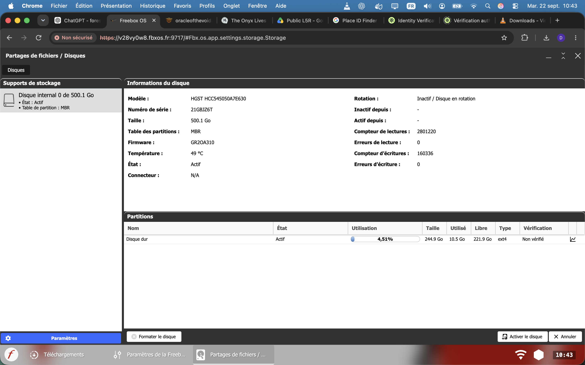{ width=50% }

### Explorateur de fichiers

L'explorateur de fichiers intégré à Freebox OS permet d'accéder aux fichiers stockés sur le disque dur interne. Au moment du constat, il contenait uniquement des fichiers liés à des enregistrements TV. Aucun autre fichier n'était visible dans l'explorateur de fichiers.

Les enregistrements identifiés sont :

- quatre épisodes de « Rénovation XXL - Bienvenue au château », diffusés sur Chérie 25 le 10 juillet 2022 ;
- un épisode de « Les reportages de Martin Weill - Mexique : avoir 20 ans sous les Narcos (n°2) », diffusé sur TMC le 4 avril 2023.

Il y a donc **5 enregistrements TV**, chacun accompagné de son fichier d'index `.m2ts.idx`.

Les fichiers vidéo ont été examinés et présentent des caractéristiques compatibles avec des enregistrements de programmes télévisés. Aucun élément particulier en lien avec l'objet de la mission n'a été relevé dans ces fichiers. Les fichiers `.m2ts.idx` associés correspondent à des fichiers d'index techniques utilisés pour la gestion et la lecture des enregistrements.

```text
# Échantillon d'examen de fichier vidéo avec mediainfo
General
ID                                       : 45770 (0xB2CA)
Format                                   : BDAV
Format/Info                              : Blu-ray Video
File size                                : 695 MiB
Duration                                 : 49 min 44 s
Overall bit rate mode                    : Variable
Overall bit rate                         : 1 953 kb/s
Frame rate                               : 25.000 FPS

Video
ID                                       : 120 (0x78)
Menu ID                                  : 45770 (0xB2CA)
Format                                   : AVC
Format/Info                              : Advanced Video Codec
Format profile                           : High@L4
Format settings                          : CABAC / 4 Ref Frames
Codec ID                                 : 27
Duration                                 : 49 min 43 s
Width                                    : 720 pixels
Height                                   : 576 pixels
Display aspect ratio                     : 16:9
Frame rate                               : 25.000 FPS
Standard                                 : PAL
Color space                              : YUV
Chroma subsampling                       : 4:2:0
Bit depth                                : 8 bits
Scan type                                : MBAFF
Scan order                               : Top Field First

Audio #1
ID                                       : 130 (0x82)
Format                                   : AAC LC
Format/Info                              : Advanced Audio Codec Low Complexity
Format version                           : Version 2
Muxing mode                              : ADTS
Codec ID                                 : 15-2
Duration                                 : 49 min 44 s
Bit rate mode                            : Variable
Channel(s)                               : 2 channels
Channel layout                           : L R
Sampling rate                            : 48.0 kHz
Frame rate                               : 46.875 FPS (1024 SPF)
Compression mode                         : Lossy
Delay relative to video                  : -507 ms
Language                                 : French

Audio #2
ID                                       : 131 (0x83)
Format                                   : AAC LC SBR
Commercial name                          : HE-AAC
Format version                           : Version 2
Format settings                          : Implicit
Muxing mode                              : ADTS
Codec ID                                 : 15-2
Duration                                 : 49 min 44 s
Bit rate mode                            : Variable
Channel(s)                               : 2 channels
Channel layout                           : L R
Sampling rate                            : 48.0 kHz
Frame rate                               : 23.438 FPS (2048 SPF)
Compression mode                         : Lossy
Delay relative to video                  : -195 ms
Language                                 : qaa

Audio #3
ID                                       : 132 (0x84)
Format                                   : AAC LC SBR
Commercial name                          : HE-AAC
Format version                           : Version 2
Format settings                          : Implicit
Muxing mode                              : ADTS
Codec ID                                 : 15-2
Duration                                 : 49 min 43 s
Bit rate mode                            : Variable
Channel(s)                               : 2 channels
Channel layout                           : L R
Sampling rate                            : 48.0 kHz
Frame rate                               : 23.438 FPS (2048 SPF)
Compression mode                         : Lossy
Delay relative to video                  : -299 ms
Language                                 : qad

Text #1
ID                                       : 140 (0x8C)-888
Format                                   : Teletext Subtitle
Language                                 : French
Language, more info                      : For hearing impaired people

Text #2
ID                                       : 140 (0x8C)-889
Format                                   : Teletext Subtitle
Language                                 : French
```

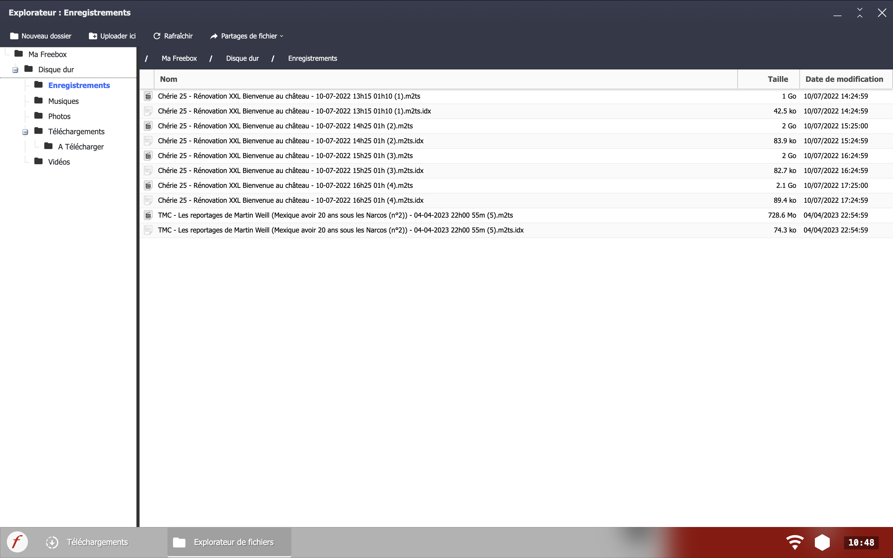{ width=50% }

### FTP

**Serveur FTP** - Le serveur FTP intégré à la Freebox était désactivé au moment du constat. L'accès FTP distant était également désactivé. Une configuration d'identification existait néanmoins avec l'utilisateur `freebox`, le mot de passe associé étant signalé par Freebox OS comme insuffisamment robuste. Les ports FTP configurés (477 pour le contrôle et 12448 pour les données en mode passif) étaient précédemment constatés comme inactifs. Aucun démarrage réseau par TFTP n'était configuré, les champs relatifs au serveur TFTP et au fichier de démarrage étant vides.

Cela ne permet pas d'exclure qu'un accès FTP ait été actif à une date antérieure, mais aucun accès FTP n'était visible dans les journaux au moment du constat.

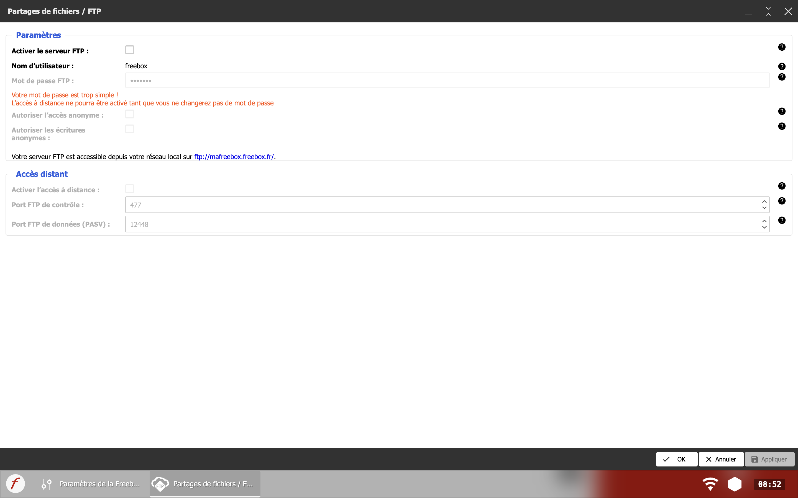{ width=50% }

### Partage de fichiers

#### Partage SMB

Les protocoles SMB2/SMB3 ainsi que le partage de fichiers étaient activés sur la Freebox. L'accès authentifié était désactivé au moment du constat, permettant un accès au partage depuis le réseau local sans identification supplémentaire au niveau de la Freebox. Le partage d'imprimantes était désactivé.

Le partage SMB n'était pas exposé directement à Internet dans la configuration observée. En revanche, un équipement ayant accès au réseau local, notamment par Wi-Fi ou Ethernet, pouvait potentiellement accéder aux fichiers partagés sans authentification supplémentaire au niveau de la Freebox.

Au moment du constat, le disque dur interne de la Freebox ne contenait que des fichiers liés aux enregistrements TV, et aucun autre fichier n'était visible dans l'explorateur de fichiers.

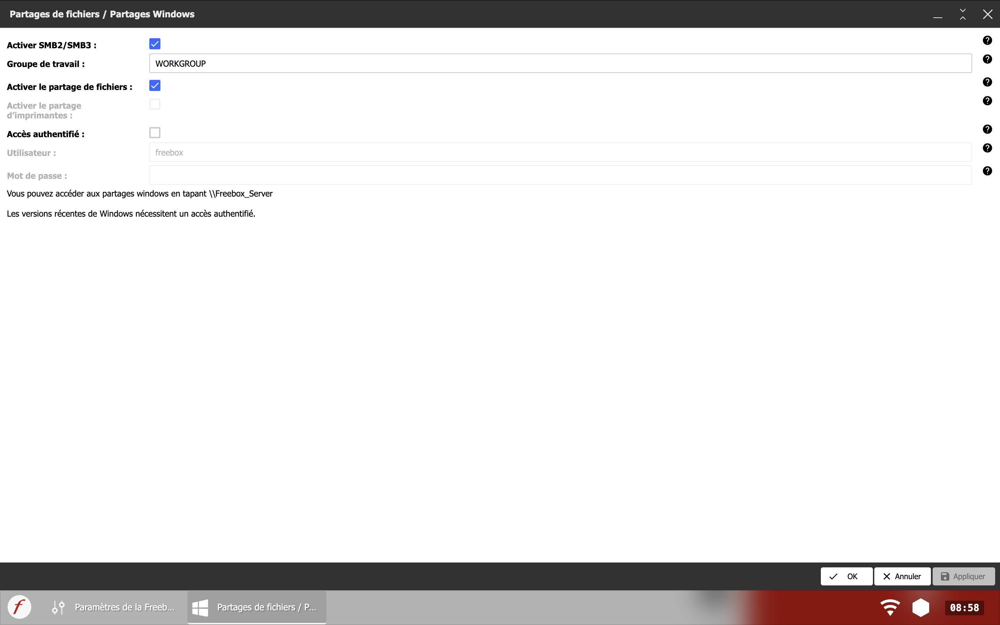{ width=50% }

#### Partage de fichiers Mac OS

Le service de partage de fichiers spécifique à macOS était désactivé au moment du constat. Aucun accès via ce protocole n'était donc actif. Cette désactivation n'empêche toutefois pas un Mac d'accéder aux fichiers partagés de la Freebox via SMB, qui était pour sa part activé.

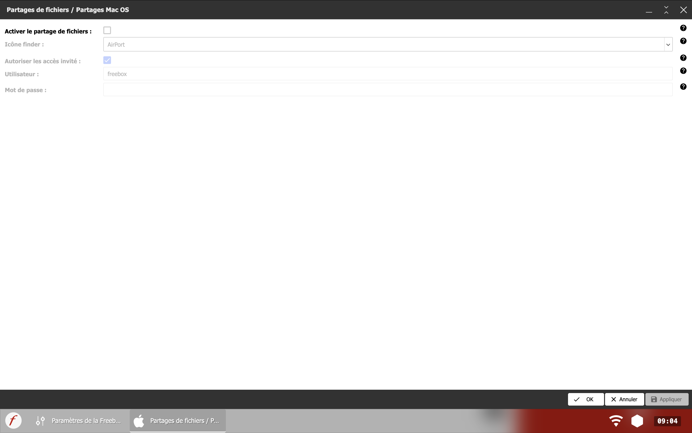{ width=50% }

## Synthèse intermédiaire

- pas de redirection de port manuelle ;
- pas de DMZ ;
- aucune redirection UPnP active ;
- aucun serveur VPN actif ;
- client VPN inactif et journal vide ;
- aucune session Freebox OS inconnue actuellement ouverte ;
- pas d'application associée avec des droits d'accès anormaux visibles ;
- pas de DNS dynamique configuré ;
- serveur FTP désactivé et accès FTP distant désactivé ;
- aucun démarrage réseau TFTP configuré ;
- partage de fichiers Mac OS désactivé ;
- partage SMB2/SMB3 activé sur le réseau local, sans authentification supplémentaire au niveau de la Freebox ;
- le partage SMB observé concerne le stockage exposé par la Freebox et n'apparaît pas directement accessible depuis Internet ;
- le pare-feu IPv6 de la Freebox était désactivé au moment du constat ; cet état mérite d'être relevé, sans permettre à lui seul de conclure qu'un équipement était effectivement exposé depuis Internet ;
- aucun fichier inhabituel relevé sur le disque ; les fichiers examinés correspondent à des enregistrements télévisés et à leurs fichiers d'index ;
- équipements réseau visibles globalement compatibles avec ceux déclarés par la cliente, sous réserve de l'identification définitive de certains appareils ;
- aucun historique WPS visible au moment du constat.

> **À ce stade de l'analyse, l'examen de la configuration actuelle de la Freebox n'a mis en évidence aucun élément caractérisant une intrusion active, un accès distant non autorisé ou une exposition manifestement anormale du réseau local.** Certains réglages, notamment le partage SMB sans authentification supplémentaire sur le réseau local et la désactivation du pare-feu IPv6, constituent néanmoins des paramètres permissifs qui doivent être distingués d'une preuve d'intrusion. Cette constatation porte sur l'état observable au moment de l'examen et ne permet pas, à elle seule, d'exclure un accès antérieur ou une activité qui ne serait plus conservée dans les journaux disponibles.
